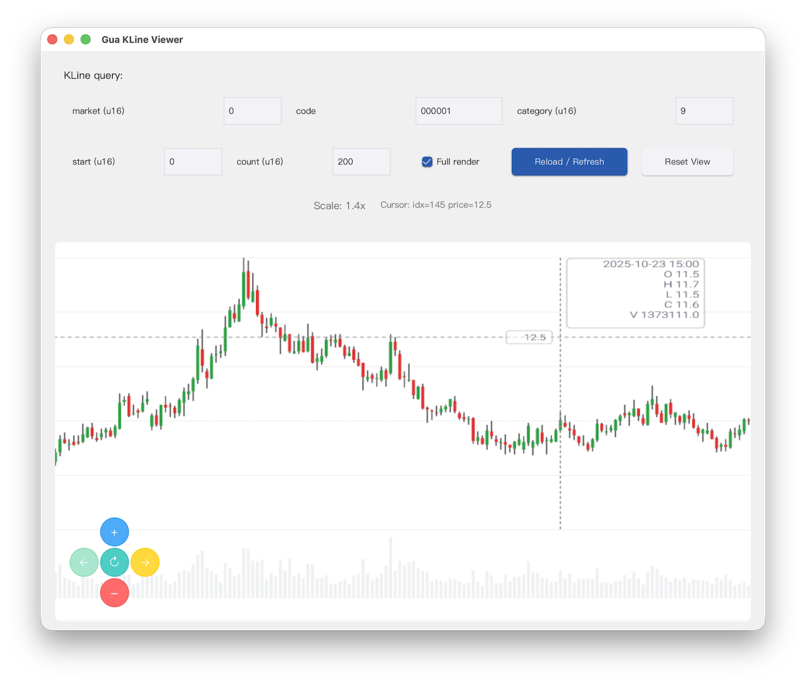

  

<h1 align="center">
  中国股票市场查看器
</h1>

  基于 Rust 构建的轻量级 TCP 桌面行情查看工具

  
  
  
  
  

  

  <a href="./README.md">English</a> | 简体中文

---

## 📌 简介

**中国股票市场查看器（China Stock Market Viewer）** 是一个轻量级、偏实验性但已可实际使用的桌面应用，用于通过 **直接 TCP 连接**（兼容 **TDX 协议**）查看中国股票市场行情数据。

本项目基于原始 **Rustdx TCP 实现** 派生出的自定义 `FeedClient` 构建，目标在于验证：相较于现代商业化 Web API，**直接 TCP 行情访问**是否依然具备可行性、透明性与可控性。

与自 v0.4 起转向商业 HTTP API 的上游 Rustdx 不同，本项目有意持续探索 **Pytdx 风格的 TCP 模型**，并将重点放在正确性、可观测性以及显式的失败处理上。

---

## 🔍 界面预览

  

---

## 项目概览

本项目目前提供以下能力：

- **阻塞式、确定性的 TCP 客户端**
- 明确的请求 / 响应解码流程
- 可用的 **桌面行情查看 UI**
- 不依赖 Tokio 的线程并发模型
- 清晰的错误传播与失败可见性

该工具已可用于 **真实环境下的探索性和研究性使用**，目前尚未观察到协议或传输层面的根本性问题。

---

## 项目背景

从 **Rustdx v0.4** 开始，上游项目停止维护 TCP 传输层，转而采用商业化 Web API，主要原因在于 **上游行情服务器 IP 不稳定** 以及由此带来的运维复杂度。

原本设想中的 TCP 路线图包括：

- IP 探测与健康检查
- 连接池
- 自动故障切换（Failover）

但由于长期维护成本较高，这些计划最终在上游被放弃。

尽管如此，早期 Rustdx 的 TCP 实现依然奠定了**非常扎实的技术基础**，包括：

- 结构清晰的二进制协议解析
- 干净、明确的数据模型
- 传输层、解码层与领域逻辑的良好分离

本项目正是在这一基础之上，重新引入了一个**经过刻意收敛范围的 TCP 客户端**，以保持整体的清晰性与稳健性。

---

## 设计理念

### 为什么选择 TCP 而不是 Web API？

这是一个**有意识的架构选择**，并非试图取代商业行情服务。

**主要动机包括：**

1. **透明性与可控性**  
   - 直接暴露底层协议与数据流  
   - 不存在隐藏的限流或不透明的重试逻辑

2. **架构简单性**  
   - 无需 HTTP 栈或 JSON 解析  
   - 依赖更少，调试更直接

3. **Pytdx 已验证的模型**  
   - TCP + IP 池 + 重试在实践中是可行的  
   - 问题主要在运维层面，而非理论不可行

4. **避免厂商绑定**  
   - 无 API Key  
   - 无调用配额限制  
   - 适合私有部署与离线分析

5. **显式的失败处理**  
   - 超时、重连、背压都清晰可见  
   - 避免 Web API 中常见的“静默退化”

> 需要明确的是：TCP 模型对工程纪律要求更高。  
> 本项目愿意为此付出成本，以换取清晰性与控制力。

---

## 项目对比

| 功能 / 项目 | Pytdx | Rustdx（≥0.4） | 本项目 |
|------------|-------|----------------|--------|
| 传输方式   | TCP   | Web API        | TCP    |
| IP 池      | ✅    | ❌             | ✅     |
| 故障切换   | ✅    | ❌             | ✅     |
| 连接池     | ✅    | ❌             | ✅     |
| 阻塞式 API | ✅    | ❌             | ✅     |
| 异步栈     | ❌    | ✅             | ⚠️（设计选择） |
| 厂商绑定   | ❌    | ✅             | ❌     |
| 可调试性   | 高    | 中             | 高     |

说明：  
✅ 已实现 ⚠️ 部分 / 演进中 ❌ 不支持

---

## 当前状态（v0.5.0）

**当前已具备：**

- 基于 TCP 的 `FeedClient`
- 稳定的协议解码逻辑
- K 线（蜡烛图）数据获取
- 基于线程的并发模型
- 桌面行情查看 UI
- 确定性的阻塞行为

**本项目明确不是：**

- Pytdx 的直接 Rust 替代品
- 全自动自愈的数据服务
- 商业级行情平台

该版本在功能与目标上是**刻意保守且边界清晰的**。

---

## 路线图

### v0.3.x
- IP 健康度评分
- 更智能的重试策略
- 可配置的超时策略
- 改进日志与指标

### v0.4.x
- 批量请求优化
- 更完善的背压处理

### v0.5.x
- Android 支持
- Windows 发行改进

### 明确的非目标
- 取代商业 Web API
- 不计成本追求极限吞吐
- 抽象或隐藏 TCP 语义

---

## 项目哲学

本项目坚持以下原则：

- **正确性优先于技巧性**
- **显式行为优先于隐式自动化**
- **可理解性优先于过度抽象**

如果你能够接受 TCP、阻塞式 I/O 以及清晰可见的失败模式，本工具旨在为你提供**对行情数据管道的完全掌控能力**。

---

## 许可证

MIT

